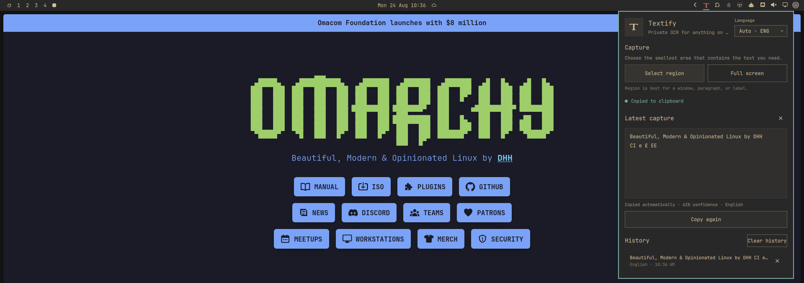

# Textify

[](LICENSE)


Native Omarchy Quickshell bar widget to extract text from any region of your
screen and copy it to the clipboard. Select a region (or grab the whole
screen), and the text lands on your clipboard instantly — no network, no
cloud, fully local.



Powered by [tesseract](https://github.com/tesseract-ocr/tesseract) with
`slurp`/`grim` (Wayland capture) and ImageMagick (pre-processing).

## Features

- **Select region** — click the icon, drag a box over any text, done.
- **Full screen** — grab everything on screen in one shot.
- **Auto-copy** — extracted text is copied to the clipboard immediately.
- **History** — the last 12 extractions are kept in the panel; click one to
  copy it again.
- **Local & private** — everything runs on your machine. No API keys, no
  uploads, no network.
- **Rust engine** — a small `textify` CLI (`serde`, zero heavyweight deps) that
  orchestrates the pipeline with fixed argument lists (no shell), temp files
  in private directories under `$XDG_RUNTIME_DIR`, and cleanup on every exit
  path.

## Requirements

- Omarchy 4 with its Quickshell bar
- `slurp`, `grim` (Wayland screen capture)
- `tesseract` (OCR engine) with at least the `eng` language data
- `identify` (ImageMagick, required to enforce image bounds)
- `magick` (ImageMagick, optional pre-processing — falls back to the validated
  raw image)
- `wl-copy` (Wayland clipboard)

All of these are present on a standard Omarchy install. For other languages,
install the matching tesseract data, e.g. `tesseract-ocr-por` for Portuguese.

## Install

```sh
omarchy plugin add https://github.com/jltrench/textify.git --enable
cd ~/.config/omarchy/plugins/jltrench.textify && make install
omarchy bar move jltrench.textify --section right
```

The marketplace install clones the repository; `make install` builds the Rust
binary into the plugin folder (requires `cargo`/`rustc` at build time only).
No elevated privileges are required; everything lives in
`~/.config/omarchy/plugins/jltrench.textify/`.

### From this repository

```sh
git clone https://github.com/jltrench/textify.git
cd textify
make install                                  # builds native/ + installs plugin
omarchy plugin enable jltrench.textify right   # adds the widget to the bar
```

### Updating / removing

```sh
git pull && make install      # update in place
make remove                   # uninstall
```

## Usage

Click the OCR icon in the bar:

| Control | Action |
| --- | --- |
| Select region | Drag a box over text to extract it |
| Full screen | Extract text from the whole screen |
| Copy again | Re-copy the last extraction |
| History row | Click to copy that extraction again |
| Esc | Close the panel |

### CLI

The same engine is usable standalone:

```sh
~/.config/omarchy/plugins/jltrench.textify/bin/textify region --json
~/.config/omarchy/plugins/jltrench.textify/bin/textify full
~/.config/omarchy/plugins/jltrench.textify/bin/textify file ~/Pictures/photo.png
~/.config/omarchy/plugins/jltrench.textify/bin/textify langs
printf '%s' "some text" | ~/.config/omarchy/plugins/jltrench.textify/bin/textify copy
```

`--json` prints `{"text": "...", "lang": "eng", "copied": true, "source": "screen"}`.

### Security and privacy

Omarchy plugins run with the current user's permissions. Textify does not
request elevated privileges, open network connections, upload images, or
invoke a shell. It launches only the documented local tools above, plus
`hyprctl`/`fcitx5-remote` for best-effort language detection. Screen captures
and intermediate images are kept in private temporary directories and
removed when the OCR process exits. Clipboard text is sent to `wl-copy` over
stdin, never as a process argument. The engine enforces bounded runtimes and
output, a 32 KiB text/result limit, a 64 MiB image limit, 10,000 px dimensions,
50 megapixels, bounded language/region/path fields, and ImageMagick plus OS
resource limits. The panel also bounds process output and history before QML
retains it. The optional `file` command reads only the path explicitly
supplied by the user.

## Development

```sh
make build       # cargo build --release
make test        # cargo unit tests
make lint        # qmllint against the installed shell imports
make validate    # manifest validation via omarchy plugin validate
```

Layout:

```
manifest.json     Plugin manifest (marketplace contract)
BarWidget.qml     Bar entry point (SVG icon recolored per theme)
Panel.qml         OCR panel state + processes + history
icon.svg          Bar icon (Phosphor scan icon)
native/src/main.rs   CLI dispatch
native/src/engine.rs  slurp/grim/magick/tesseract/wl-copy pipeline
```

Saved changes under `~/.config/omarchy/plugins/` hot-reload; force with
`omarchy-shell shell rescanPlugins`. If a change refuses to apply (stale QML
disk cache), run `omarchy restart shell`. Inspect runtime errors with
`qs log -p "$OMARCHY_PATH/shell" --tail 100`.

## Acknowledgements

- [tesseract](https://github.com/tesseract-ocr/tesseract) for OCR.
- [slurp](https://github.com/hyprwm/slurp) / [grim](https://github.com/emersion/grim) for Wayland capture.
- ImageMagick for image pre-processing.
- The Omarchy shell kit and its built-in plugins, used as reference for the
  panel lifecycle (`Panel`, `KeyboardPanel`, `WidgetButton`).
- Icon: Phosphor Icons (MIT).

## License

[MIT](LICENSE).
